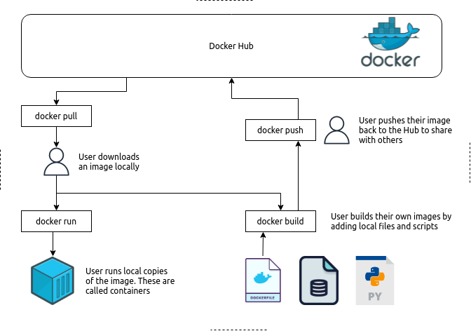

# Homework: Reading Material

- [What is Docker](https://www.freecodecamp.org/news/docker-simplified-96639a35ff36/)
    - Great article on _What is Docker? And what problem it helps to solve?_
    - Explains docker architecture and basic _Docker Terminology_
    - Feel free to stop reading at the _"Installing Docker"_ section. The mini-course below has a much better intro to using docker commands.
- [Docker mini-course](https://docker-curriculum.com/)
    - Great article to understand multi-container applications and concepts such as: _Docker Networking_ and _docker-compose_
    - Please read up to the end of _"Webapps with Docker > Dockerfile"_ section. Feel free to skip the rest; they are more advanced topics that we'll cover later.

<br/><br/>

# Overview

## What is docker?

Docker is a great technology that allows user to run pre-packaged _containers_ (virtual machines) on any machine. Containers are mini virtual machines that come pre-configured with software or applications and run inside your computer. Think of them as an isolated machine within your machine. The advantage is that they come pre-configured with applications; so instead of installing MariaDB (Mysql) or any other database directly on your machine you can just pull and run the MariaDB container (or _image_) on your machine. This completely frees you from all the installation and configuration steps. It also allows you to run multiple databases (containers) on your machine without them interfering with each other!

## Docker Terminology

### Images

A docker image is a pre-configured machine with software and application. Developers can develop images and push them to Docker Hub (an online repository) where anyone else in the world can pull that image and run it on their local machine. Images are typically built on top of other _base images_ such as ubuntu, python3.9, or alpine (a very small bare minimum linux machine) and add their own application on top. The instructions to build an image is typically contained in a file called Dockerfile. You'll read more about Dockerfiles below, but think of them as the blueprint to build an image. 

Images are often incorrectly called Containers!

### Containers

A container is a running instance of an image on your machine. You typically pull an image (the binary code) from Docker Hub and run an instance of it on your local machine. This _container_ is an isolated running instance of the original _image_. You can run multiple containers simultaneously on your machine. As stated above, the terms images and containers are often interchanged. 

### Docker Hub

[Docker hub](https://hub.docker.com/) is the public online repository where developers can upload their images. These images are publicly accessible by anyone else and can be _pulled_ and _run_ locally. This makes it very easy for developers to package and distribute their code. Docker Hub is easily searchable for existing images. It also often contains a brief documentation on how to pull and use the container locally. For example look at the [MariaDB Docker Hub image](https://hub.docker.com/_/mariadb).The advantage is that you can also build on top of existing Docker Hub images; that is to use them as the base image for your application and add more stuff on top!

Docker Hub is the main public _Docker Repository_. There are other docker repositories which are more restricted or specific to a platform. For example _Google Container Registry_ is a service to host and run private docker repositories on GCP. Other Cloud vendors like AWS and Azure also have their own similar service. These repositories allow enterprises to host their own private _registry_ (docker hub) adhering to their internal  data security policies. 

### Dockerfile

Dockerfile is a text file that includes instructions to build an image. It declares a _base image_ on top followed by instructions to add other files, applications, and configuration. For example you can see the [MariaDB Dockerfile](https://github.com/MariaDB/mariadb-docker/blob/60caa9ea5c46b985ac6a7ebc93564a29791fca08/10.6/Dockerfile) example on github. Base images are maintained by docker community; they are the base bare minimum images used by other images. Some examples of base images include: [ubuntu](https://hub.docker.com/_/ubuntu/), [python](https://hub.docker.com/_/python/), or [alpine](https://hub.docker.com/_/alpine) (a very small linux image).

### Volumes

_Docker Volumes_ are a way for docker containers to persist data. Typically once a docker container stops running all its data is erased and vanished. This is actually useful since it allows developers to test applications without having any consequences! If the test is not going well, just stop the container and start a new one. Docker always guarantees that your new containers is completely cleaned and error free!

But often you would like to persist data in between docker container runs. That is achieved by using _volumes_. Volumes are mini (virtual) hard drives (storage) attached to a container as a directory (such as /data). They persist data after the container is stopped and can later be mounted to another container. 

Volumes can also be simultaneously mounted to multiple containers which is a very powerful features to containers to exchange data files.

### docker-compose

_Docker Compose_ is a utility that allows docker to start and configure multiple containers at the same time. This is very useful for starting more complex applications that have multiple components such as a database, a webserver, a dashboard, etc... Each component is deployed in their own container and containers are configured to communicate with each other within the compose group. The instruction to start the containers are typically written in yaml file named _docker-compose.yml_.

### Kubernetes 

We don't cover _Kubernetes_ engine in this course but you should understand what it is. _Kubernetes_ is a platform to orchestrate running hundreds and thousands of containers at the same time. It addresses DevOps needs such as automatically scaling up or down a webserver applications by running more/less containers to dynamically adapt to web traffic. 

## How is docker used in the context of data engineering 

Docker is widely used by data engineers! Docker allows data engineers to build custom images that includes all their necessary software packages (like python and pypi packages) and custom ETL scripts to transform and manipulate data. Further, docker allows developers to share these images with other team members. Because docker containers are run in isolated environments, docker guarantees images to run the same no matter where they are executed. 

The diagram below shows a typical docker workflow:



## Docker Installation

If you haven't done so already follow the [docker install](https://docs.docker.com/get-docker/) guide. Make sure docker is properly installed on your machine.

<br/><br/>

# Mastering Docker CLI

_Docker-cli_ is the command line interface of docker which allows you to pull, run, start/stop, and inspect containers. By the end of this course you'll be an docker-cli expert and comfortably start/stop containers on your machine.

Let's get started! 

<br/>

## Docker pull and run

To test your docker installation, docker likes to have you run the following command:

```bash
docker run hello-world
```

This command pulls and runs the docker _hello-world_ image which displays a welcome message in your terminal. The _hello-word_ image is a very simple image that only prints the welcome message and exits. If you look at the message printed, you see that docker actually internally ran two consecutive commands:

1. `docker pull hello-world`
1. `docker run hello-world`

The first command, _pull_, searches docker hub for a specific image with the name _hello-world_ and pulls (downloads) a copy of that image on your machine. The second command, _run_, runs a local container of this image on your machine which outputs the welcome message you saw. This is because is because docker is smart enough to know when it doesn't have a local copy of an image that you're trying to run; therefore it pulls it from docker hub first.

The syntax for these commands are as follow: `docker <command> <image-name>`; where _<command>_ is either `pull` or `run`. 

<br/>

Let's look at another basic image called _busybox_. Run `busybox` docker image and print a message to the screen:

```bash
# pull down the busybox image locally
docker pull busybox

# run the busybox image. nothing happens! 
docker run busybox
```

Nothing happens when you run the command above! This is because _busybox_ is a simple linux container that runs basic shell commands and outputs them to the screen; but you didn't provide _'docker run'_ with a command to run. To provide a command to busybox run:


```bash
docker run busybox echo "hello from busybox"
```

This command runs the command _'echo "hello from busybox"'_ inside the busybox container which outputs your message to the terminal. Any command following the image name in _docker run_ is passed to the image to run upon entry. The syntax is:

`docker run <additional_run_options> <image_name> <command_to_run>`

Let's do more examples:

```bash
# list the home directory of busybox
docker run busybox ls /

# using additional run options:
# add a --rm option to remove the running container from docker immediately after run
docker run --rm busybox echo "Wish you were here... swimming in a fish bowl year after year"
```

<br/>

## Docker Images

When you use docker pull or run, docker downloads a copy of the image from docker hub onto your local machine. To see a list of your local images you can use the `docker images` command:

```bash
# see a list of local images
docker images


REPOSITORY                  TAG           IMAGE ID       CREATED        SIZE
hello-world                 latest        feb5d9fea6a5   5 weeks ago    13.3kB
busybox                     latest        388056c9a683   6 months ago   1.23MB
```

**NOTE:**

Pay attention to the columns printed on this table:

1. **REPOSITORY**: is the fully qualified name of the docker image on docker hub. This is a unique name. Base containers (containers managed by docker) have a short name like _'hello-world'_. Users can create an account on docker hub and upload their own images. These images have a longer name in the form of _'<docker_hub_account_name>/<image_name>'_ (ie: _'datastackacademy/dsa-deb-ch5ep2'_)
1. **TAG**: Refers to the specific tag or version of an image. Images option have different variations or versions which are differentiated by their tag. If the tag name is omitted (in docker run or other commands), the default `latest` tag is used. For example the [python](https://hub.docker.com/_/python) image has many different tags (versions). You can run an specific image by addressing its tag:

    ```bash
    # run the latest version (currently this is 3.10)
    docker run python:latest

    # run python 3.9
    docker run python:3.9

    # run python 3.9 slim edition
    docker run python:3.9-slim
    ```

<br/>

## Docker ps and rm

Docker keeps track of containers that you're running. To see a list of active and inactive (exited) containers use the `docker ps` command:


```bash
# show a list of running containers
# it's ok if you don't see anything! That just means there's no actively running containers
docker ps 

CONTAINER ID   IMAGE     COMMAND   CREATED   STATUS    PORTS     NAMES

# show a list all containers including exited containers
docker ps -a


CONTAINER ID   IMAGE         COMMAND                  CREATED          STATUS                      PORTS     NAMES
3b88d917feda   busybox       "echo 'hello from bu…"   7 seconds ago    Exited (0) 7 seconds ago              musing_lewin
b11b28aa818e   hello-world   "/hello"                 20 seconds ago   Exited (0) 20 seconds ago             upbeat_bassi
2ff40ce83e43   busybox       "ls /"                   26 seconds ago   Exited (0) 25 seconds ago             interesting_jepsen
```

The `-a` option tells _'docker ps'_ to print all containers, including exited containers. 

**NOTE:** 

Pay attention to columns printed here:

1. **CONTAINER_ID, NAMES:** Show a unique id and name for the container instance. Containers can either be referenced by their ID or name. Later on you'll see command such as _'docker rm'_ or _'docker kill'_ which kills and remove images referenced by their name or id. Docker automatically assigns a unique id and name to each container. The name can be customized by the user with the `--name` option of the `docker run` command. For example:

    `docker run --name testbox busybox echo "testbox container name"`

1. **COMMAND:** Shows the command that was passed onto _'docker run'_ and executed upon the entry of the container
1. **STATUS:** Shows the current status of the container (whether it's running or exited). You'll see later how you can interact with running containers.
1. **PORTS:** Shows the list of ports that the container exposes onto its host machine. For example: webserver containers usually expose their port 80 (http port) onto their host machine. This ports can be accessed on the host by using a web browser URL: _http://localhost:80/_

<br/>

As you can see, exited docker containers linger on the host machine. It's best practice that you remove them and do some housekeeping every once in a while to remove any unused containers and their storage space. 

To remove a container use the `docker rm` command:

```bash
# list the container names or ids
docker ps -a

CONTAINER ID   IMAGE         COMMAND                  CREATED          STATUS                      PORTS     NAMES
3b88d917feda   busybox       "echo 'hello from bu…"   7 seconds ago    Exited (0) 7 seconds ago              musing_lewin
b11b28aa818e   hello-world   "/hello"                 20 seconds ago   Exited (0) 20 seconds ago             upbeat_bassi
2ff40ce83e43   busybox       "ls /"                   26 seconds ago   Exited (0) 25 seconds ago             interesting_jepsen

# note the container id or name.
# for example: 
#   our 1st container ID is '3b88d917feda' with the name 'musing_lewin'
#   our 2nd container ID is 'b11b28aa818e' with the name 'upbeat_bassi'

# YOU WILL HAVE DIFFERENT IDs and NAMEs THAN US!

# remove a container by ID
docker rm -vf 3b88d917feda

# remove a container by NAME
docker rm -vf upbeat_bassi

```

**NOTE**:

1. `-v` option also removes any docker _volumes_ (saved files for this containers) associated with the container that are no longer used. This will free up space.
1. `-f` forces the removal of the container which means the container is killed first if it's still running. You can also use `docker kill` to kill run containers before removing them from the ps list

<br/>

You can also remove any docker images from your local registry by using `docker rmi` command. This will free up storage space by used images:

```bash
# remove an image by <name>:<tag>
docker rmi hello-world:latest

# now, list existing images
docker images

REPOSITORY                  TAG           IMAGE ID       CREATED        SIZE
busybox                     latest        388056c9a683   6 months ago   1.23MB
```

<br/>

Another great **housekeeping** command is `prune`. This command removes any unused images or containers; freeing up storage space on your host machine:

```bash
# big housekeeping command
docker system prune -f
```

NOTE: `-f` removes containers and images without asking you first. You can remove this option to be prompted with what's about to be deleted.

<br/>

## Docker run with terminal access

When running docker containers with `docker run` you can use the `-it` option to gain terminal access inside the running container. _`-it`_ is short for _--interactive_ _--terminal_.

To start a container with terminal access run:

```bash
# pull the latest ubuntu image (currently ubuntu 20.04 focal)
docker pull ubuntu:latest

# run docker with -it
# pay attention, this command also starts a /bin/bash session upon docker run entry
# -it option with trailing `/bin/bash` command tells docker to start a bash session with an interactive terminal (-it)
docker run -it --rm ubuntu:latest /bin/bash
```

Now, you are inside the ubuntu container terminal. You can run any ubuntu command inside the container and exit:

```bash
> ls
bin  boot  dev  etc  home  lib  lib32  lib64  libx32  media  mnt  opt  proc  root  run  sbin  srv  sys  tmp  usr  var

> uname -a
Linux e5af9e019b09 5.11.0-38-generic #42~20.04.1-Ubuntu SMP Tue Sep 28 20:41:07 UTC 2021 x86_64 x86_64 x86_64 GNU/Linux

> cat /etc/os-release 
NAME="Ubuntu"
VERSION="20.04.2 LTS (Focal Fossa)"
ID=ubuntu
ID_LIKE=debian
PRETTY_NAME="Ubuntu 20.04.2 LTS"
VERSION_ID="20.04"
HOME_URL="https://www.ubuntu.com/"
SUPPORT_URL="https://help.ubuntu.com/"
BUG_REPORT_URL="https://bugs.launchpad.net/ubuntu/"
PRIVACY_POLICY_URL="https://www.ubuntu.com/legal/terms-and-policies/privacy-policy"
VERSION_CODENAME=focal
UBUNTU_CODENAME=focal

> exit
exit
```

**NOTE:**

1. Above commands are ran inside the ubuntu container 
1. `--rm` option tells docker to remove the container immediately after it exists
1. the `-it` option with trailing `/bin/bash` command tells docker to start a _bash_ session with an _interactive terminal (-it)_

<br/>

## Detached containers and Docker Exec

Another feature of _docker run_ is running containers in detached mode or in background. Containers in detached mode keep running in the background. This is very useful for containers such as web servers which need to continuously run in the background waiting for HTTP requests. Users can later use `docker exec` to attach to a running container and gain terminal access. 

The following example shows:

1. Running an ubuntu bash session in detached mode
1. Listing containers to see the container continues to run in the background
1. Using _'docker exec'_ to gain terminal access to the container
1. Killing and removing the container from the background

```bash
# a little housekeeping first, remove all dangling containers for a clean slate
docker system prune -f

# start a ubuntu bash session in detached mode
#   -d: tells docker to run in the container in the background (detached)
#   -i: tells docker to keep an --interactive interface open to the container
#   --name: names this container my-ubuntu. this is a unique name which should not be used with any other running container
docker run -d -i --name my-ubuntu ubuntu:latest /bin/bash

# list running containers 
# see that my-ubuntu container is still running
docker ps

CONTAINER ID   IMAGE           COMMAND       CREATED         STATUS        PORTS     NAMES
b71672c8e9a2   ubuntu:latest   "/bin/bash"   3 seconds ago   Up 1 second             my-ubuntu

# docker exec runs a command on a running container
#   ie: here we cat the os-release info file
docker exec my-ubuntu cat /etc/os-release

# you can also use exec to run a command and attach to its terminal 
# ie: here we run a new bash session with interactive terminal access
docker exec -it my-ubuntu /bin/bash

# now you're inside the image
> uname -a
Linux e5af9e019b09 5.11.0-38-generic #42~20.04.1-Ubuntu SMP Tue Sep 28 20:41:07 UTC 2021 x86_64 x86_64 x86_64 GNU/Linux

> exit

# exit the terminal with the exit command above.
# Now, you're back at your hots machine

# kill/remove the running container
docker rm -vf my-ubuntu

```

**NOTE:**

1. `-d` option tells docker to run in the container in the background (detached). This option combined with `-i` ensures that your container is kept alive.
1. `-i` option  tells docker to keep an --interactive interface open to the container.
1. `docker exec` runs a command on a running container. It is very similar to _'docker run'_ but instead of image name it takes the container name or ID. The syntax is:

    `docker exec <options> <container_name> <command_to_run>`

1. You must remove detached containers using `docker rm -f` to force killing and removal of the container.


#### Exercise
Compare the use of `exec` above to its use in ch5/ep1. How are they similar, and how are they different?

<br/><br/>

## Docker Volumes

One of the advantages of docker containers is that they are like a **_gold fish_**; meaning that they don't remember anything! Once you exit a container, everything in it is lost forever. This is actually very helpful to using them as a sandbox. You can start containers, test anything, and don't worry if you're going to break anything. Once you exit the container everything is lost and you can start a new container for your next test!

But what if you want to persist files?

You can do this by one of the two ways:

1. Mount a directory on the host machine to a directory inside the container
1. Use docker volumes which persist in between runs and can be attached to containers

Both these two options use the `-v` option of `docker run` and are explained below

### Attaching host dirs to containers

Under this episode there's a directory called _./data/_ which contains two files _index.html_ and _names.txt_. The _names.txt_ is a simple file which contains a series of sample docker container names.

Now, we're going to:

1. Use the docker run `-v` option to mount the data/ directory to a container
1. Once a directory is mounted, it can be used as a directory inside the container
1. Add line to _names.txt_ file inside the container
1. Exit the container and observe our changes are written to our host dir

```bash
# pay attention to the content of your names.txt file on your host machine
cat data/names.txt

# run a container and attach the local data/ directory under container's app-data dir
docker run -di --name ubuntu-vol-1 -v $(pwd)/data:/app-data ubuntu /bin/bash

# attach to the container and add a line to names.txt under app-data
docker exec -it ubuntu-vol-1 /bin/bash


# these command are ran inside the container terminal
> ls /app-data
> echo "sweet_horizon" >> /app-data/names.txt
> exit


# you've exited the container terminal now

# examine your names.txt on host machine. see that the new line is added to the end
cat data/names.txt

# remove the image
docker rm -vf ubuntu-vol-1
```

**NOTE:**

1. `-v` option attaches a local host directory to a container upon its start
1. the syntax for using `-v` is:

    `-v <full_path_to_local_dir>:<full_path_to_container_dir>`

    The fist path before `:` is the full path to your local dir. The path following `:` is the mounted directory name inside your container. ie: 

    `-v $(pwd)/data:/app-data`

**NOTE:**

This is widely used in data engineering. Files from a host machine are manipulated and transformed by scripts inside a container. This feature enables containers to access host data. Most **Cloud implementation** of docker **allow** cloud storage buckets (ie: gcs buckets) to be mounted onto a container on the cloud; allowing users to directly manipulate cloud files from containers. You'll see an example of this later via using _Google Cloud Run_ service. 

<br/>

### Using Docker Volumes

In addition to using local host dirs, you can use docker volumes as the built-in docker feature to persist storage dirs on a container. Similar to host dirs, docker volumes are attached to containers using the `-v` option and they persist their data after the container is exited. The volume can later be attached to another container. 

Here we will:

1. Create a docker volume that persists beyond a single docker container
1. Run a container and attached the volume to it
1. Modify files inside the volume
1. Exit the container and run another container with the same volume attached
1. See your changes from the previous run (container)


```bash
# create a new volume
docker volume create ub1-data

# list exiting volumes
docker volume ls
DRIVER    VOLUME NAME
local     ub1-data

# run a container and attach this volume
docker run -it --rm -v ub1-data:/app-data ubuntu /bin/bash

# add a file into our volume (this is running inside the container)
> echo "a data file that persists!" > /app-data/file.txt
> exit

# see that your container has completely exited
docker ps -a

# run another container and attach the same volume
docker run -it --rm -v ub1-data:/app-data ubuntu /bin/bash

# run these commands inside the docker container
> cat /app-data/file.txt
> exit

# now delete the volume 
docker volume rm ub1-data
```

**NOTE:**

1. `docker volume create` is used to create built-in docker managed volumes (storage dirs)
1. These volumes persist even after a container has exited
1. same `-v` option is used to attach a volume to a container dir by its name

<br/>

You can also inspect volumes on the host machine by:

```bash
# inspect a volume and grab its Mountpoint location on the host machine
docker volume inspect ub1-data

[
    {
        "CreatedAt": "2021-10-30T18:21:52-07:00",
        "Driver": "local",
        "Labels": {},
        "Mountpoint": "/var/lib/docker/volumes/ub1-data/_data",
        "Name": "ub1-data",
        "Options": {},
        "Scope": "local"
    }
]

# here the location on the host machine is: /var/lib/docker/volumes/ub1-data/_data

# list the volume content on the host machine. you must use sudo (root) user for this
sudo ls /var/lib/docker/volumes/ub1-data/_data
```

<br/>

**Remember** to always remove unused docker volumes to free up space after you're done with them:


```bash
# using volume rm
docker volume rm ub1-data

# using volume prune 
# removes all dangling volumes that are not currently attached to any container
docker volume prune -f
```

<br/>

## Passing environment variables

Another way to pass information to a container is via environment variable. You set and pass in environment variables by using the docker run `-e` option. This is commonly used to pass in configuration information to a container.

For example: the [MariaDB](https://hub.docker.com/_/mariadb) docker image uses an environment variable called _MARIADB_ROOT_PASSWORD_ to set the root password for the database. 

In example below, we will:

1. Start a container with a custom print message as an environment variable
1. Enter the container terminal and examine the value of our variable

```bash
# set a custom environment variable
docker run -it --rm -e PRINT_MSG='So, so you think you can tell... heaven from hell?' ubuntu /bin/bash

# inside the container terminal
> echo $PRINT_MSG
> exit
```

#### Exercise
Go back to the `start_db.sh` script in ch2/ep1. What environment variable is being set there? What is it being set to? When is that variable later accessed?

<br/>

## Exposing Ports

Many containers need to expose their ports to the host machine or other containers. This allows containers to communicate with each other or be accessible by the host machine. 

For example a webserver image (such as _nginx_) needs to expose its default http port 80 to be accessible via a browser on the host machine. 

Docker run uses the `-p` option to expose ports from a container onto the host. The syntax is `-p <port_on_host>:<post_on_container>`.

In the example below, we will:

1. Pull down and use the _[nginx](https://hub.docker.com/_/nginx)_ webserver image
1. Attached our local /data dir to be hosted as the webserver root folder. This folder contains a _index.html_ file that will be hosted.
1. Use the `-p` option to map the container http port (80) onto our host port 8080
1. Access the exposed port via a browser on our host machine

```bash
# pull nginx, a static web server
docker pull nginx

# run a server exposing port 80 of container onto port 8080 of the hots
docker run -d --name nginx-server -v $(pwd)/data:/usr/share/nginx/html:ro -p 8080:80 nginx
```

Open a browser and go to [http://localhost:8080/](http://localhost:8080/).

<br/><br/>

That was a lot to take in! You've learned so much and now that you feel like a docker-cli master, sit back and relax 😉️

<br/><br/>

## Docker cli help

Don't worry if you forget how to use particular docker commands. You can view the help for any docker command:

```bash
docker help <command_name>

# show the help for docker run
docker help run

# show the help for docker volume ls
docker help volume ls
```


## Quiz Questions
- What problems does Docker solve?
- What's a Docker image?
- Where can you search for available Docker images?
- What's a Docker container?
- What is the dockerfile for?
- What are volumes used for? Provide an example of a use-case.